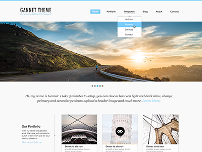

# Gannet Theme

Gannet is a minimalistic WordPress theme designed for photography or portfolio websites, but works just as well for blogs.

# Dependencies
- Node: only tested with v12.4.0 - use [NVM](https://github.com/nvm-sh/nvm) to manage multiple Node versions
- [Yarn](https://yarnpkg.com/lang/en/)
- [VVV](https://varyingvagrantvagrants.org/) - Other development environments not supported, please figure that out yourself if you don't want to use VVV.

## Getting Started

1. Clone this repo. `git clone https://github.com/duanecilliers/gannet-theme /path/to/vvv/www/wordpress-one/public_html/wp-content/themes/gannet`
1. Run `nvm use` to use supported node version or manually install v12.4.0. Older versions might work, but no guarantees.
1. Run `yarn install` to install local dependencies
1. Run `yarn serve` to watch sass files and serve `one.wordpress.test`. Assumes use with [VVV](https://varyingvagrantvagrants.org/).

Your browser will auto reload when PHP files change and Sass files will be auto compiled to CSS and injected into the browser window while the server is running. This makes iteration much faster.

## Contribution guidelines

For information related to contributing to Gannet, please check out the [CONTRIBUTING](./CONTRIBUTING.md) documentation.